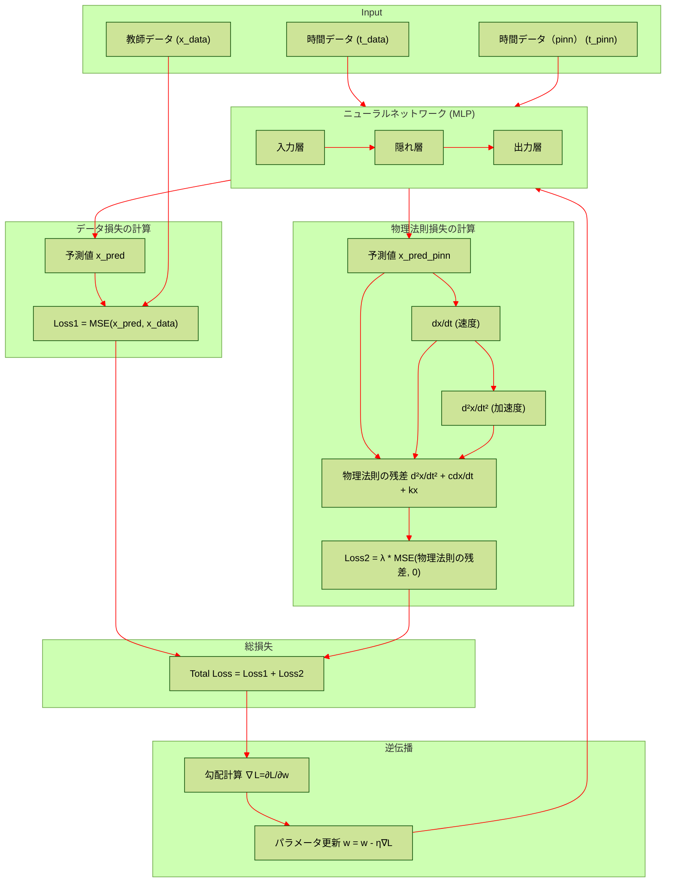

```mermaid
%%{
  init: {
    'theme': 'forest',
    'themeVariables': {
        'fontFamily': 'arial',
        'fontSize': '14px',
        'primaryColor': '#0af',
        'primaryBorderColor': '#00f',
        'primaryTextColor': '#fff',
        'lineColor': '#f00'
    }
  }
}%%
flowchart TB
    subgraph Input
        t_data["時間データ (t_data)"]
        x_data["教師データ (x_data)"]
        t_pinn["時間データ（pinn） (t_pinn)"]
    end

    subgraph NeuralNetwork["ニューラルネットワーク (MLP)"]
        direction LR
        input_layer["入力層"]
        hidden_layers["隠れ層"]
        output_layer["出力層"]
        input_layer --> hidden_layers
        hidden_layers --> output_layer
    end

    subgraph DataLoss["データ損失の計算"]
        pred["予測値 x_pred"]
        loss1["Loss1 = MSE(x_pred, x_data)"]
    end

    subgraph PhysicsLoss["物理法則損失の計算"]
        direction TB
        x_pinn["予測値 x_pred_pinn"]
        dx_dt["dx/dt (速度)"]
        dx_dt2["d²x/dt² (加速度)"]
        physics["物理法則の残差 d²x/dt² + cdx/dt + kx"]
        loss2["Loss2 = λ * MSE(物理法則の残差, 0)"]
    end

    subgraph TotalLoss["総損失"]
        total["Total Loss = Loss1 + Loss2"]
    end

    subgraph Backprop["逆伝播"]
        grad["勾配計算 ∇L=∂L/∂w"]
        update["パラメータ更新 w = w - η∇L"]
        grad --> update
    end

    t_data --> NeuralNetwork
    NeuralNetwork --> pred
    pred --> loss1
    x_data --> loss1

    t_pinn --> NeuralNetwork
    NeuralNetwork --> x_pinn
    x_pinn --> dx_dt
    dx_dt --> dx_dt2
    x_pinn --> physics
    dx_dt --> physics
    dx_dt2 --> physics
    physics --> loss2

    loss1 --> total
    loss2 --> total
    total --> grad
    update --> NeuralNetwork


```